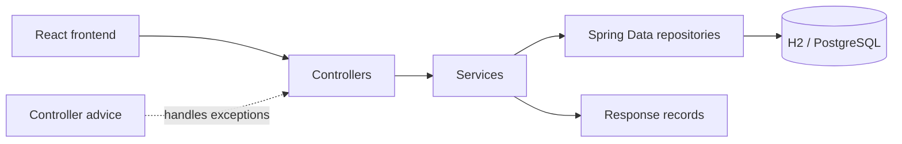

# 01 Architecture and Design Patterns

## 1. Overall architecture

This is a small layered REST API. Spring scans downward from `com.pelinportfolio.api`, constructs components, routes HTTP requests to controllers, and uses blocking JPA repositories for persistence.

## Pattern: Controller–Service–Repository

### Where it appears

Every endpoint follows it: for example `ProjectController → ProjectService → ProjectRepository`.

### Problem, use, value

It separates HTTP binding, application decisions, and persistence. Controllers remain tiny; services own transaction/mapping behavior; repositories describe queries. Without it, controllers would mix HTTP and database concerns. A controller could call repositories directly, but the service seam is justified by mapping and errors and gives future change room. The tradeoff is more files for a tiny app.

## Pattern: DTO

`ContactRequest` is input; the five `*Response`/`ApiErrorResponse` records are output. Entity fields are not serialized directly. This protects the API from persistence changes and intentionally omits contact-message contents from the success response. Returning entities is shorter but couples JSON to JPA. Records are a good fit because contracts are immutable data.

## Pattern: Dependency injection / IoC

Controllers and services declare constructor dependencies; Spring creates and supplies them. `CorsConfig` receives a property via `@Value`, while the seed runner receives repositories as bean-method parameters. Constructor injection makes required dependencies explicit and fields final. Field injection is shorter but harder to instantiate and test.

## Pattern: Repository

The four interfaces extend `JpaRepository<Entity, IdType>`. Spring generates implementations. Three derived methods encode `ORDER BY display_order ASC` in their names. Raw JDBC/jOOQ would expose SQL and improve query control but add code that this CRUD-scale project does not need.

## Pattern: Static factory/manual mapper

`ProjectResponse.from`, `SkillResponse.from`, and `ResearchResponse.from` manually map entities. The service invokes them with method references. This is transparent and debuggable. MapStruct becomes attractive only after mapping volume grows; reflection-based ModelMapper would hide behavior for little gain.

## Pattern: Global exception translation

`@RestControllerAdvice` maps domain lookup failure, validation failure, and unreadable JSON into one `ApiErrorResponse` shape. Without it, Spring's default error bodies or controller-local try/catch would be inconsistent. It is under-complete: unexpected exceptions and database failures have no project-specific response.

## Pattern: Configuration

`application.yml` contains default and `postgres` profile documents; environment placeholders override port, origin and credentials. `CorsConfig` turns the origin property into MVC policy. `@ConfigurationProperties` would scale better if `app.*` grows.

## Pattern: Validation

Declarative annotations live on `ContactRequest`; controller `@Valid` triggers them before service execution. The honeypot uses `@Size(max=0)`. Database column constraints provide a second, different boundary. Manual or custom validators are alternatives for cross-field/business rules.

## Pattern: Conditional startup seed

A `CommandLineRunner` inserts projects, skills and research only when each table is empty. It is convenient for a demo. It is fragile for production because count-based seeding is not migration/version aware and silently preserves stale rows.

## Patterns not present

There is no authentication/authorization, CQRS, event bus, cache, hexagonal architecture, admin service, email adapter, database migration tool, or pagination. Adding those now would mostly be overengineering. A Flyway migration is the clearest future exception once PostgreSQL data matters.

## Why this structure and tradeoff verdict

The structure teaches mainstream Spring layering and is defensible for a portfolio. It is slightly file-heavy for five endpoints, but not unreasonable. DTOs and advice add useful boundaries; separate read services are thin but consistent. The backend is underengineered in durability, abuse protection and tests, not in layer count.
