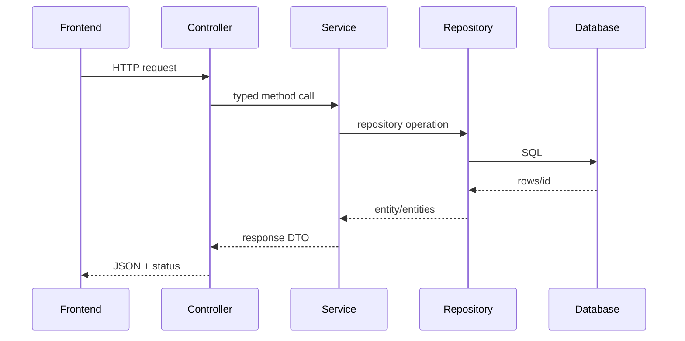

# 04 Method Call Graph

## GET `/api/projects`

```txt
ProjectsSection.useEffect
→ getProjects()
→ requestJson("/api/projects")
→ ProjectController.getProjects()
→ ProjectService.findAll()
→ ProjectRepository.findAllByOrderByDisplayOrderAsc()
→ SQL ordered by display_order
→ ProjectResponse.from(entity) for each row
→ toProject(response) for each JSON item
→ React state and rendering
```

`getProjects` receives no parameters, delegates to the service and returns JSON with implicit 200. `findAll` opens a read-only transaction, retrieves ordered entities, maps them, and returns an unmodifiable stream result. Spring parses the repository method name and generates the query.

## GET `/api/projects/{id}`

```txt
getProject(id) [exported but no current component caller found]
→ encodeURIComponent(id)
→ ProjectController.getProject(@PathVariable id)
→ ProjectService.findById(id)
→ JpaRepository.findById(id)
→ ProjectResponse.from OR ResourceNotFoundException
→ GlobalExceptionHandler.handleNotFound()
→ 200 DTO OR 404 ApiErrorResponse
```

## GET `/api/skills`

```txt
SkillsSection.useEffect → getSkills → requestJson
→ SkillController.getSkills → SkillService.findAll
→ SkillRepository.findAllByOrderByDisplayOrderAsc
→ SkillResponse.from
→ frontend groups flat rows by category using Map
→ React state/render
```

## GET `/api/research`

```txt
InterestsSection.useEffect → getResearch → requestJson
→ ResearchController.getResearchItems → ResearchService.findAll
→ ResearchItemRepository.findAllByOrderByDisplayOrderAsc
→ ResearchResponse.from → frontend narrows fields → render
```

## POST `/api/contact`

```txt
ContactSection.handleSubmit
→ submitContact(form values + empty website honeypot)
→ requestJson POST JSON
→ CORS filter
→ Jackson creates ContactRequest
→ @Valid evaluates constraints
→ ContactController.createContactMessage
→ ContactService.save
→ normalize strings + Instant.now
→ ContactMessageRepository.save
→ INSERT contact_messages
→ ContactResponse
→ 201 JSON
→ success state and form reset
```

Invalid DTO: `MethodArgumentNotValidException → handleValidation → 400`. Invalid JSON: `HttpMessageNotReadableException → handleUnreadableJson → 400`. A database failure is not explicitly handled.



## Startup call graph

`main → SpringApplication.run → component scan/autoconfiguration → DataSource/JPA/schema → seedPortfolioData bean → CommandLineRunner → count each content table → projects()/skills()/researchItems() → saveAll when empty`.
